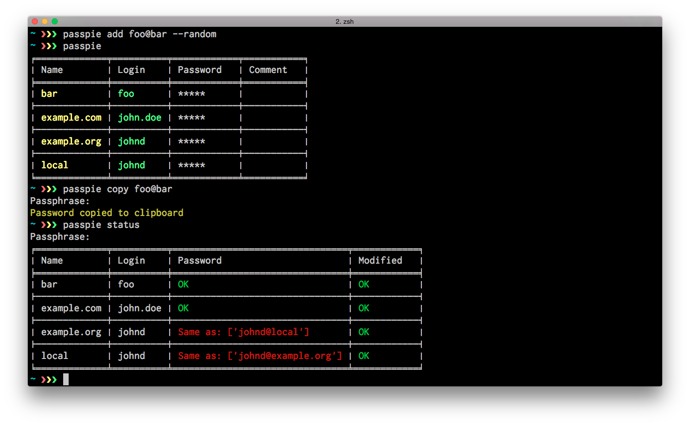

# Passpie: Manage login credentials from terminal

## 

[Passpie](https://marcwebbie.github.io/passpie) helps you manage login credentials from the terminal with a colorful andconfigurable interface. Password files are saved into yaml text files with passwords encrypted using [GnuPG](http://en.wikipedia.org/wiki/GNU_Privacy_Guard). Use your master passphrase to decrypt login credentials, copy passwords to clipboard syncronize them to a git repository and more...

## [](https://pypi.python.org/pypi/passpie) [](https://travis-ci.org/marcwebbie/passpie) [](https://ci.appveyor.com/project/marcwebbie/passpie) [](https://codecov.io/github/marcwebbie/passpie)


## Installation

```bash
pip install passpie
```

Or on a *mac*, with [homebrew](http://brew.sh):

```bash
brew install passpie
```

> Or to install the *latest development* version:
```bash
pip install -U https://github.com/marcwebbie/passpie/tarball/master
```

## Quickstart

```bash
passpie init
passpie add foo@example.com --random --pattern '[0-9]{5}[a-z]{5}'
passpie add bar@example.com --random --pattern '[0-9]{5}[a-z]{5}'
passpie copy foo@example.com
passpie
```

`outputs`:

```bash
╒═════════════╤═════════╤════════════╤═══════════╕
│ Name        │ Login   │ Password   │ Comment   │
╞═════════════╪═════════╪════════════╪═══════════╡
│ example.com │ bar     │ *****      │           │
├─────────────┼─────────┼────────────┼───────────┤
│ example.com │ foo     │ *****      │           │
╘═════════════╧═════════╧════════════╧═══════════╛
```

### Usage

| Command        | Description                                           |
|----------------|-------------------------------------------------------|
| **`add`**      | Add new credential to database                        |
| **`complete`** | Generate completion scripts for shells                |
| **`copy`**     | Copy credential password to clipboard/stdout          |
| **`export`**   | Export credentials in plain text                      |
| **`import`**   | Import credentials from file                          |
| **`init`**     | Initialize new passpie database                       |
| **`log`**      | Shows passpie database changes history                |
| **`purge`**    | Remove all credentials from database                  |
| **`remove`**   | Remove credential                                     |
| **`reset`**    | Renew passpie database and re-encrypt all credentials |
| **`search`**   | Search credentials by regular expressions             |
| **`status`**   | Diagnose database for improvements                    |
| **`update`**   | Update credential                                     |

Initializing a passpie database:

```bash
passpie init
```

Adding credentials

```bash
# Adding a credential. You will be promped to enter a password
passpie add foo@example.com

# Adding a credential with comments
passpie add foo+commented@example.com --comment "Commented credential"

# Force re-adding a credential
passpie add foo+commented@example.com --force
```

Grouping credentials

```bash
passpie add foo@opensource/github.com --random
passpie add foo@opensource/python.org --random
passpie add foo@opensource/bitbucket.org --random
passpie add foo@opensource/npm.org --random
```

> Learn more: [Grouping Credentials](./docs/grouping.md)

Randomizing passwords

```bash
# Adding credential with random password pattern
passpie add john.doe@example.com --random --pattern '[0-9]{5}[a-z]{5}'

# Updating credential with random password pattern
passpie update john.doe@example.com --random --pattern "[0-9\#\$\%\w\ ]{32}"

# Adding credential with random password and copy generated password to clipboard
passpie add john.doe@example.com --copy --random --pattern '[0-9]{5}[a-z]{5}'
```

Using multiple databases

```bash
# Creating multiple databases
mkdir ~/credentials
passpie -D ~/credentials/personal init
passpie -D ~/credentials/work init
passpie -D ~/credentials/junk init

# Inserting credentials into specific databases
passpie -D ~/credentials/personal add johnd@github.com --random
passpie -D ~/credentials/work add john.doe@example.com --random
passpie -D ~/credentials/junk add fake@example.com --random
```

Updating and removing credentials

```bash
# Update credential. You will be promped with changes
passpie update foo@example.com

# Update credential to a random password. Skip prompts
passpie update -y --random foo@example.com

# Remove credential
passpie remove foo@example.com

# Remove credential. Skip prompts
passpie remove -y foo@example.com
```

Searching credentials

```bash
# search credentials by string "exam"
passpie search exam

# search credentials using regular expressions
passpie search '[fF]oo|bar'
```

Version control and sync databases

```bash
# see the database change history
passpie log

# reset to a previous version of the database
passpie --reset-to 5

# Initialize git history on an existing database
passpie log --init
```

Reseting and purging a database

```bash
# Delete all credentials from database
passpie purge

# Redefine passphrase and reencrypt all credentials from database
passpie reset
```

Playing with *volatile* database.

```bash
# Listing credentials from a remote database
passpie -D https://foo@example.com/user/repo.git

# Adding credentials to a remote database and autopushing changes
passpie -D https://foo@example.com/user/repo.git --autopush "origin/master" add foo+nouveau@example.com

# Exporting environment variables
export PASSPIE_DATABASE=https://foo@example.com/user/repo.git
export PASSPIE_AUTOPULL=origin/master
export PASSPIE_AUTOPUSH=origin/master

# List remote credentials
passpie

# Copy remote `foo@example.com` password
passpie copy foo@example.com

# Add credential with random password directly to remote
passpie add foo+nouveau@example.com --random --pattern "[0-9\#\$\%\w\ ]{32}"
passpie add foo+nouveau@example.com --random --pattern "[0-9\#\$\%\w\ ]{32}"
```

## Configuring passpie

### Global

You can override passpie default configuration with a **passpierc** file. Global user settings are read from the `~/.passpierc`

> Note that Passpie configuration files must be written as a valid [yaml](http://yaml.org/) file.

### Per-database

You can also add database specific configuration by creating a file called `.config` inside database directory. These files are automatically created when initializing databases.

### Fields

| Option                                                                                     | Description                                                                 |
|--------------------------------------------------------------------------------------------|-----------------------------------------------------------------------------|
| [path](./docs/configuration.md#path)                                                       | Path to default database                                                    |
| [homedir](./docs/configuration.md#homedir)                                                 | Path to gnupg homedir                                                       |
| [recipient](./docs/configuration.md#recipient)                                             | Default gpg recipient to encrypt/decrypt credentials using keychains        |
| [key_length](./docs/configuration.md#key_length)                                           | Key generation length                                                       |
| [repo](./docs/configuration.md#repo)                                                       | Create a git repo by default                                                |
| [autopull](./docs/configuration.md#autopull)                                               | Automatically pull changes from git remote repository                       |
| [copy_timeout](./docs/configuration.md#copy_timeout)                                       | Automatically clear password from clipboard                                 |
| [short_commands](./docs/configuration.md#short_commands)                                   | Use passpie commands with short aliases. Like `passpie a` for `passpie add` |
| [status_repeated_passwords_limit](./docs/configuration.md#status_repeated_passwords_limit) | Repeat credential fullname on status list                                   |
| [extension](./docs/configuration.md#extension)                                             | Credential files configurable extension                                     |
| [genpass_pattern](./docs/configuration.md#genpass_pattern)                                 | Regular expression pattern used to generate random passwords                |
| [headers](./docs/configuration.md#headers)                                                 | Credential columns to be printed                                            |
| [table_format](./docs/configuration.md#table_format)                                       | Defines how the Table is formated                                           |
| [colors](./docs/configuration.md#colors)                                                   | Column data colors                                                          |

> More configuration details on [configuring passpie](./docs/configuration.md)

## Learn more

- [Diving into *fullname* syntax](./docs/fullname.md)
- [Grouping Credentials](./docs/grouping.md)
- [Multiple Databases](./docs/multiple_databases.md)
- [Syncing Credentials](./docs/syncing.md)
- [Version Control With Git](./docs/syncing.md)
- [Exporting Credentials](#)
- [Importing Credentials](./docs/importing.md)
- [Contributing](./docs/contributing.md)


## Bugs & Questions

You can file bugs in our github [issues tracker](https://github.com/marcwebbie/passpie/issues), and ask any technical questions on Stack Overflow using the passpie tag.


## Common issues

#### GPG not installed. https://www.gnupg.org/

You don't have gpg installed or it is not working as expected

Make sure you have [gpg](https://www.gnupg.org/) installed:

Ubuntu:

```
sudo apt-get install gpg
```

OSX:

```
brew install gpg
```

#### xclip or xsel not installed

You don't have *copy to clipboard* support by default on some linux distributions.

Ubuntu:

```
sudo apt-get install xclip
```

#### passpie init hangs

Sometimes it takes a long time because of entropy on the host machine. It was noticed a long time on an ubuntu server(even more if it is a virtual machine). You could try using `haveged` to generate enough entropy.

On ubuntu:

```
sudo apt-get install haveged
```


## Licence [](./LICENSE)

Copyright (c) 2014-2016 Marcwebbie, <http://github.com/marcwebbie>

> Full license here: [LICENSE](./LICENSE)
